Párovač faktur pro AbraFlexi
============================

Instalace balíčku po spuštění (vytvoří potřebné štítky  NEIDENTIFIKOVANO a CHYBIFAKTURA)

K dispozici jsou tři skripty na párování faktur:

[ParujFakturyNew2Old.php](src/ParujFakturyNew2Old.php) - páruje faktury po jednotlivých dnech zpět až 3mesíce.
[ParujVydaneFaktury.php](src/ParujVydaneFaktury.php)   - pokusí se spárovat všechny nespárované vydané doklady
[ParujPrijateFaktury.php](src/ParujPrijateFaktury.php) - pokusí se spárovat všechny nespárované přijaté doklady
[ParujPrijatouBanku.php](src/ParujPrijatouBanku.php)   - pokusí se spárovat vhodné faktury k dané příchozí platbě.

Algoritmus je následující:

* stažení výpisů z banky do abraflexi
* projdou se všechny nespárované příjmy v bance ( /c/firma_s_r_o_/banka/(sparovano eq false AND typPohybuK eq 'typPohybu.prijem' AND storno eq false AND datVyst eq '2018-03-07' )?limit=0&order=datVyst@A&detail=custom:id,kod,varSym,specSym,sumCelkem,datVyst )
* Platby se pak v cyklu po jedné zpracovávají
* Ke každé příchozí platbě se program pokusí nalézt vhodný (neuhrazený a nestornovaný) doklad ke spárování. Nejprve podle variabilního symbolu. Nakonec dle prostého specifického symbolu.
* Výsledky jsou sjednoceny dle čísla bankovního pohybu ve abraflexi aby nedocházelo k duplicitám když faktura vyhoví více ruzným hledáním.
* Platby které nemají dohledaný protějšek dle žádné z podmínek jsou označeny štítkem NEIDENTIFIKOVANO
* Pokud k platbě není dohledána faktura, dostane platba štítek CHYBIFAKTURA

Dohledané doklady se pak párují takto:

* **FAKTURA** - platba se spáruje s fakturou + uhrazená faktura je odeslána z abraflexi na email klienta
* **ZALOHA**  - zálohová faktura je spárována s platbou + je vytvořen daňový doklad se stejným variabilním symbolem od kterého je tato záloha odečtena.
* **DOBR**    - je proveden odpočet dobropisu
* Ostatní     - je zapsáno varování do protokolu s polu s linkem do webového abraflexi

Debian/Ubuntu
-------------

Pro Linux jsou k dispozici .deb balíčky. Prosím použijte repo:

    wget -qO- https://repo.vitexsoftware.com/keyring.gpg | sudo tee /etc/apt/trusted.gpg.d/vitexsoftware.gpg
    echo "deb [signed-by=/etc/apt/trusted.gpg.d/vitexsoftware.gpg]  https://repo.vitexsoftware.com  $(lsb_release -sc) main" | sudo tee /etc/apt/sources.list.d/vitexsoftware.list
    sudo apt update
    sudo apt install abraflexi-matcher

Po instalaci balíku jsou v systému k dispozici tyto nové příkazy:

* **abraflexi-matcher**         - páruje všechny toho schopné faktury
* **abraflexi-matcher-in**      - páruje všechny toho schopné přijaté faktury
* **abraflexi-matcher-out**     - páruje všechny toho schopné vydané faktury (všechny způsoby párování najednou)
* **abraflexi-matcher-new2old** - páruje příchozí platby den po dni od nejnovějších ke starším
* **abraflexi-pull-bank**       - pouze stahne bankovní výpisy
* **abraflexi-match-bank**      - párovač příchozí platby
* **abraflexi-match-varsym**    - páruje vydané faktury s přijatými platbami pouze podle variabilního symbolu
* **abraflexi-match-specsym**   - páruje vydané faktury s přijatými platbami pouze podle specifického symbolu
* **abraflexi-match-accountno** - páruje vydané faktury s přijatými platbami pouze podle čísla bankovního účtu plátce
* **abraflexi-transaction-report** - generuje výkaz bankovních transakcí ve formátu JSON

Skripty **abraflexi-match-varsym**, **abraflexi-match-specsym**, **abraflexi-match-accountno**, **abraflexi-matcher-out**, **abraflexi-match-received-payment** a **abraflexi-matcher-in** nikdy automaticky nespárují přeplatek ani nedoplatek - pokud se výše platby neshoduje s částkou na faktuře, skutečnost se pouze zaznamená do logu a do JSON reportu (`overpaid`/`underpaid`) a faktura zůstane otevřená k ruční kontrole účetního. Automatické spárování přeplatků/nedoplatků lze zapnout přes `ABRAFLEXI_OVERPAY` / `ABRAFLEXI_PARTIAL_MATCH`.

Závislosti
----------

Tento nástroj ke svojí funkci využívá následující knihovny:

* [**EasePHP Framework**](https://github.com/VitexSoftware/php-ease-core)      - pomocné funkce např. logování
* [**AbraFlexi**](https://github.com/Spoje-NET/AbraFlexi)                      - komunikace s [AbraFlexi](https://abraflexi.eu/)
* [**AbraFlexi Bricks**](https://github.com/VitexSoftware/AbraFlexi-Bricks)    - používají se třídy Zákazníka, Upomínky a Upomínače

Testování
----------

K dispozici je základní test funkcionality spustitelný příkazem **make test** ve zdrojové složce projektu

Pouze testovací faktury a platby se vytvoří příkazem **make pretest**


Test sestavení balíčku + test instalace balíčku + test funkce balíčku obstarává [Vagrant](https://www.vagrantup.com/)

Konfigurace
-----------

* [/etc/abraflexi/client.json](client.json)   - společná konfigurace připojení k AbraFlexi serveru
* [/etc/abraflexi/matcher.json](matcher.json) - nastavení párovače:

```
    "APP_NAME": "InvoiceMatcher",             - název aplikace 
    "EASE_MAILTO": "info@yourdomain.net",         - kam odesílat reporty
    "EASE_LOGGER": "syslog|mail|console",         - jak logovat
    "DAYS_BACK": "7"                              - až kolik dní zpět párovat
    "MATCHER_LABEL_PREPLATEK": "PREPLATEK",       - štítek pro označení vetší než kolik vyžaduje uhrazovaná faktura
    "MATCHER_LABEL_CHYBIFAKTURA": "CHYBIFAKTURA", - štítek pro označení platby ke které nebyla dohledána faktura
    "MATCHER_LABEL_NEIDENTIFIKOVANO": "NEIDENTIFIKOVANO"  -
    "ABRAFLEXI_OVERPAY": 'OST. ZÁVAZKY'            - kod typu dokladu pro přeplatek, prázdné (výchozí) = přeplatky se automaticky nepárují
    "ABRAFLEXI_PARTIAL_MATCH": false               - automaticky párovat nedoplatky (částečné úhrady), výchozí false = nepárovat automaticky
```

Další software pro AbraFlexi
---------------------------

* [Pravidelné reporty z AbraFlexi](https://github.com/VitexSoftware/AbraFlexi-Digest)
* [Odesílač upomínek](https://github.com/VitexSoftware/php-abraflexi-reminder)
* [Klientská Zóna pro AbraFlexi](https://github.com/VitexSoftware/AbraFlexi-ClientZone)
* [Nástroje pro testování a správu AbraFlexi](https://github.com/VitexSoftware/AbraFlexi-TestingTools)
* [Monitoring funkce AbraFlexi serveru](https://github.com/VitexSoftware/monitoring-plugins-abraflexi)
* [AbraFlexi server bez grafických závislostí](https://github.com/VitexSoftware/abraflexi-server-deb)

Poděkování
----------

Tento software by nevznikl pez podpory:

[](https://spoje.net/)
[](http://purehtml.cz/)
[](https://ictmorava.cz)

MultiFlexi
----------

AbraFlexi Matcher is ready for run as [MultiFlexi](https://multiflexi.eu) application.
See the full list of ready-to-run applications within the MultiFlexi platform on the [application list page](https://www.multiflexi.eu/apps.php).

[](https://www.multiflexi.eu/apps.php)

| | Aplikace | Příkaz |
|---|---|---|
|  | Stahovač bankovních výpisů | `abraflexi-pull-bank` |
|  | Výkaz transakcí | `abraflexi-transaction-report` |
|  | Párovač přijatých faktur | `abraflexi-matcher-in` |
|  | Párovač vydaných faktur | `abraflexi-matcher-out` |
|  | Párovač platby (jedna platba) | `abraflexi-match-received-payment` |
|  | Párování přijatých plateb podle variabilního symbolu | `abraflexi-match-varsym` |
|  | Párování přijatých plateb podle specifického symbolu | `abraflexi-match-specsym` |
|  | Párování přijatých plateb podle čísla bankovního účtu | `abraflexi-match-accountno` |

## Vývojové diagramy

Rozhodovací logika tří samostatných párovačů plateb (jaké parametry čtou a jak se podle nich větví):

### abraflexi-match-varsym



### abraflexi-match-specsym



### abraflexi-match-accountno

Páruje tuzemské platby podle čísla účtu + kódu banky (`buc`/`smerKod`) a zahraniční platby podle IBAN, přičemž nejednoznačné číslo účtu přiřazené více firmám zaznamená do reportu jako `duplicate_buc`.



## Návratové kódy (Exit Codes)

### Výkaz transakcí (abraflexi-transaction-report)

- `0`: Úspěch - výkaz transakcí byl úspěšně vygenerován
- `1`: Obecná chyba - nastala neočekávaná chyba (možnost opakování)
- `2`: Chyba připojení - nelze se připojit k AbraFlexi serveru (kritická, možnost opakování)
- `3`: I/O chyba - selhalo uložení výstupního souboru

### Ostatní aplikace

- `0`: Úspěch
- `400`: Chybný požadavek - neplatná data nebo parametry

## Ošetření chyb

Aplikace pro výkaz transakcí obsahuje robustní ošetření chyb:

- **Selhání připojení**: Když není AbraFlexi server dostupný, aplikace zaznamená podrobnou chybovou zprávu a ukončí se s kódem 2, což umožňuje automatické opakování.
- **Kompatibilita s MultiFlexi**: Generuje reporty v MultiFlexi-kompatibilním JSON formátu se stavem, časovým razítkem, metrikami a artefakty.
- **Postupná degradace**: Všechny chyby jsou řádně zachyceny, zaznamenány a reportovány s příslušnými návratovými kódy.
